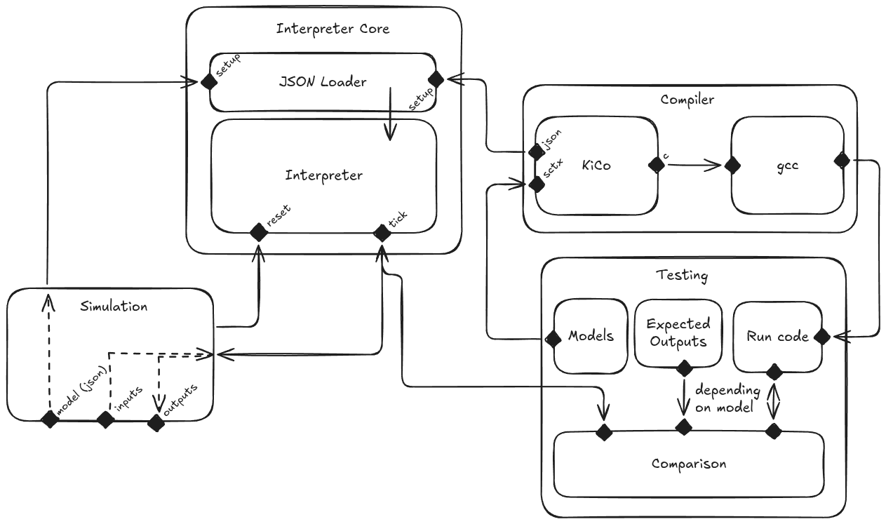

# sccharts-interpreter

## usage
### setup
To set up the project, run:

```bash
npm install
npm run build
```

### core
To run anything you need to run the core. This is done with
```bash
npm run core
```  
It contains the JSON loader and interpreter and runs as a server in the background.

### simulation
To simulate an SCChart model with the interperter use `npm run simulation`.   

By default it expects two arguments. The first is a path to the JSON and the second is your input list in JSON format. For expample
```bash
npm run simulation testing/sctx/IM.json '[{"A": true}, {"A": false},{"A": true}]'
```

There is also an interactive mode, which can be called like:
```bash
npm run simulation testing/sctx/IM.json -- -i
```
It reads inputs in JSON format from stdin every tick and prints the state of all variables as a response.


### tests
For the tests to work properly a version of the Kieler Compiler has to be downloaded (currently from this branch https://github.com/kieler/semantics/tree/dam/json) and its location configured in the `testing/config.json`. It is used to compare the results of the interpreter against that of the compiler.

The tests are written in python and require `uv` to be installed.  
Run all or specific tests with
```bash
npm run test all      # Runs all tests
npm run test ao       # Runs test ao
npm run test abo ao   # Runs tests ao and abo
```

## structure

