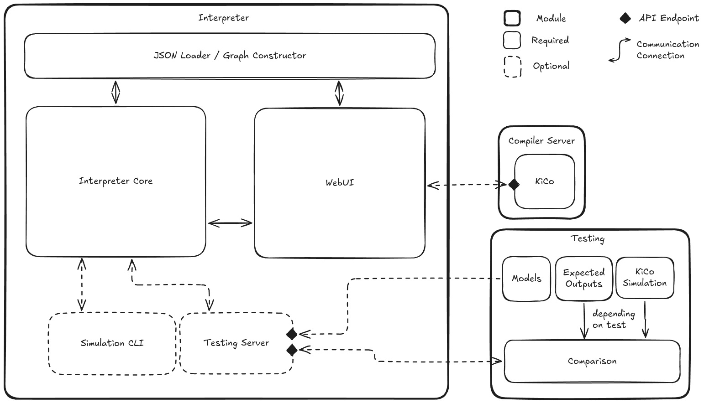

# sccharts-interpreter

## usage
### setup
To set up the project, run:

```bash
npm install
npm run build
```

### webui
```bash
npm start
```

The main usgae of the interpreter is via a webui. It is accessed via a web server and the interpreter runs locally in the browser.

### cli
If you want to use it locally in the terminal there is a cli.

By default it expects two arguments. The first is a path to the JSON and the second is your input list in JSON format. For expample
```bash
npm run cli testing/sctx/IM.json '[{"A": true}, {"A": false},{"A": true}]'
```

There is also an interactive mode, which can be called like:
```bash
npm run cli testing/sctx/IM.json -- -i
```
It reads inputs in JSON format from stdin every tick and prints the state of all variables as a response.


### tests
For the tests to work properly a version of the Kieler Compiler has to be downloaded (currently from this branch https://github.com/kieler/semantics/tree/dam/json) and its location configured in the `kico_config.json`. It is used to compare the results of the interpreter against that of the compiler.

The tests are written in python and require `uv` to be installed.  
```bash
npm run test
```

## structure

